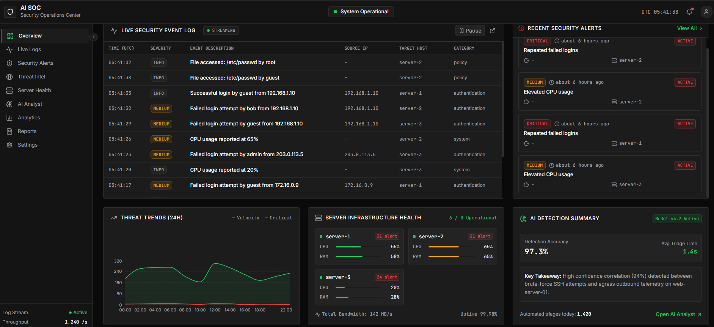
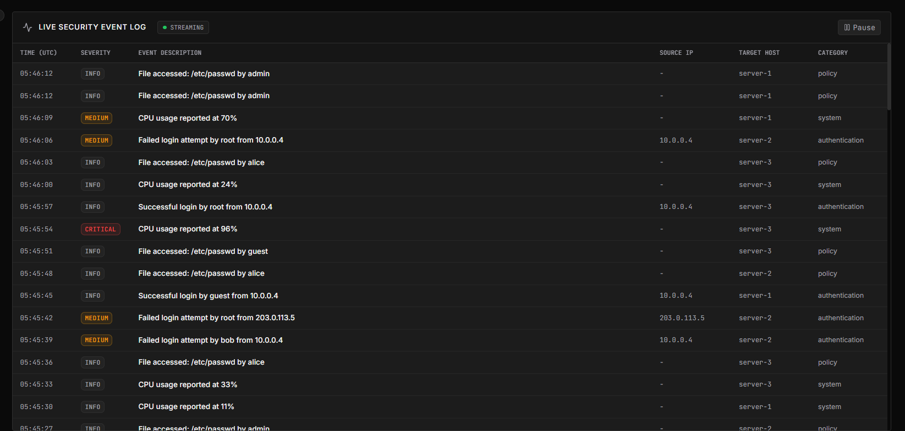
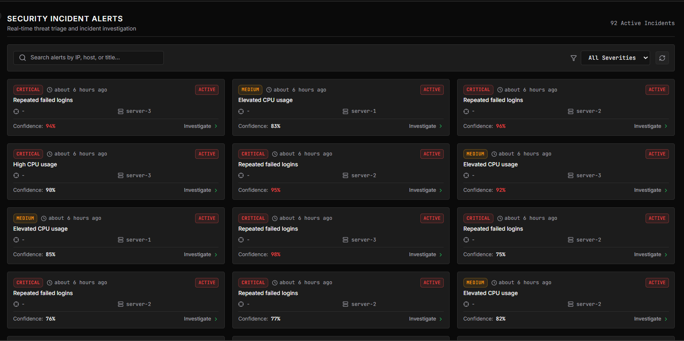
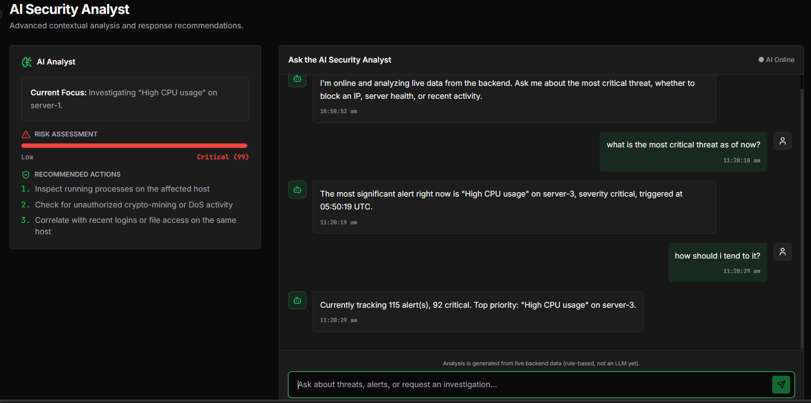
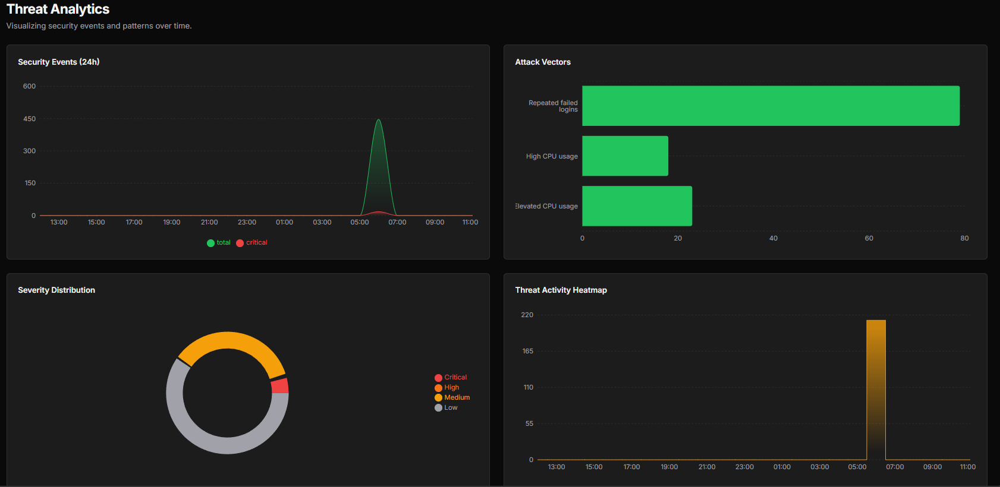
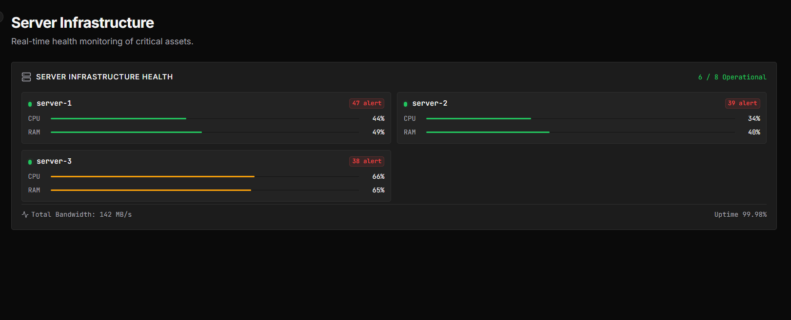

# AI SOC Dashboard

## Problem Statement
Modern organizations generate large volumes of security logs and system events every minute, but monitoring them manually is slow, error-prone, and often leads to missed alerts. Security teams need a centralized and intelligent way to identify suspicious activity, monitor server health, and respond quickly to potential threats.

## Project Overview
AI SOC Dashboard is a full-stack security monitoring solution designed to simulate a Security Operations Center (SOC) environment. It collects logs, detects suspicious behavior, and presents real-time alerts and system insights through an interactive dashboard. The project combines a React-based frontend, a FastAPI backend, and a lightweight database to deliver a practical and scalable monitoring experience.

## Key Features
- Real-time visualization of system and security events
- Live alerting for suspicious activities such as repeated failed logins and high CPU usage
- Server health monitoring with clear status indicators
- Interactive charts for performance and event trends
- A lightweight architecture that is well suited for demos, learning, and future expansion

## Tech Stack
- **Frontend:** React, TypeScript, Vite, Tailwind CSS, Recharts, and Radix UI components
- **Backend:** FastAPI, Python, Uvicorn, Pydantic, and SQLAlchemy
- **Database:** SQLite
- **Detection Logic:** Rule-based anomaly detection for security events and system health monitoring
- **Other Tools:** REST APIs, CORS support, JSON-based data exchange, and live dashboard updates

## Team Members and Contributions
- **Shreya Gupta** – Backend Development & Detection Engine
  - Developed the FastAPI backend and REST APIs
  - Designed and managed the database schema and API endpoints
  - Implemented log generation and threat detection logic
  - Built alert generation, server monitoring, and backend testing

- **Shruti Gupta** – Frontend Development & Integration
  - Designed and developed the AI SOC dashboard UI
  - Improved the user experience and dashboard layout
  - Integrated the frontend with backend APIs
  - Implemented data visualization and responsive layouts

## Demo
This section highlights the main dashboard views and monitoring workflows of the project.

### Dashboard Overview
Overall view of the AI Security Operations Center dashboard with monitoring and analytics.



### Live Security Event Log
Real-time stream of authentication events, CPU usage, and file access logs.



### Security Incident Alerts
Automatically generated alerts with severity levels and confidence scores.



### AI Analyst
AI-generated summaries and analysis of suspicious activity.



### Analytics
Visual trends and metrics for monitored servers.



### Server Health
Live monitoring of server status and resource utilization.



### Live Demo
The project is currently deployed and available at:

- [AI SOC Dashboard](https://ai-security-soc.vercel.app)

## Getting Started

### Backend
Requires Python 3.10+.

```bash
cd backend
pip install -r requirements.txt
uvicorn main:app --reload --port 8000
```

This starts the API on `http://localhost:8000` and begins generating simulated log traffic in the background so data appears immediately.

### Frontend
Requires Node 18+.

```bash
cd frontend
npm install
npm run dev
```

This starts the dashboard on `http://localhost:3000`. It reads the backend URL from `.env` using `VITE_API_URL=http://localhost:8000` by default.

Open `http://localhost:3000` to view live logs, alerts, and server health updates from the backend.

## Future Scope / Improvements
- Integrate with real SIEM tools and cloud log sources
- Add authentication and role-based access control
- Introduce machine learning-based anomaly detection
- Add email, SMS, or Slack notifications for critical incidents
- Expand analytics with advanced threat correlation and reporting